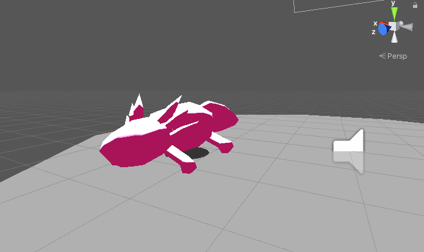

# Blender 3D Workshop for Game Development
 Basic 3D Art including:
 - Character modeling and rigging
 - Animation
   - We only got around to making a simple breathing animation! Let me know on Discord (Matthew L.) if you'd like a **part two?!**
 - Importing into Unity
 
**Zoom recording:**
[google drive](https://drive.google.com/file/d/13PV7M70rzufQGehRIAJf2PZr-ARR2m5K/view?usp=sharing)
 

### References:
 - Original "Time Sweepers" game jam entry that project is based off of: https://github.com/Alvinw9/Time
 - My game jam entry that the art style is based off of: https://mattlawr.itch.io/a-froggy-day
 - Blender: https://www.blender.org/
 
 

